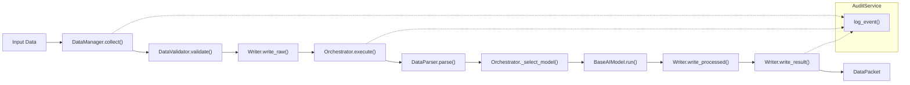

# Architecture

## Design overview

Ianuacare follows the **pipeline** pattern: a single `DataPacket` instance flows through **collect → validate → persist raw → orchestrate (parse + model) → persist processed → persist result**, with **audit** events at key stages.

## Layering

| Layer | Responsibility |
|-------|----------------|
| **Models** | `User`, `RequestContext`, `DataPacket` — immutable-friendly dataclasses (`slots=True`). |
| **Auth** | `AuthService` + `UserRepository` — token → user, permission checks. |
| **Pipeline** | `Pipeline`, `DataManager`, `DataValidator` — orchestration of stages. |
| **Orchestration** | `Orchestrator`, `DataParser` — parse input, select model, run inference. |
| **AI** | `BaseAIModel` (ABC), `NLPModel`, `AIProvider` — pluggable inference. |
| **Storage** | `DatabaseClient`, `BucketClient` (protocols), `Writer` — persistence adapters. |
| **Audit** | `AuditService` — append-only style events to a database collection. |
| **Config** | `ConfigService` — simple key/value configuration. |
| **Exceptions** | `IanuacareError` hierarchy — typed failures for consumers. |

## Relationships (from the class diagram)

- **Composition**: `Pipeline` holds `DataManager`, `DataValidator`, `Writer`, `Orchestrator`, `AuditService`. `Writer` holds `DatabaseClient` and `BucketClient`. `Orchestrator` holds `DataParser` and a `dict[str, BaseAIModel]`. `AuthService` holds `UserRepository`. `NLPModel` holds `AIProvider`.
- **Dependency**: most services accept `DataPacket` and `RequestContext` per call (no long-lived coupling).
- **Inheritance**: `NLPModel` extends `BaseAIModel`; concrete errors extend `IanuacareError`.

## Healthcare considerations

- **No PHI in audit `details`**: pass only structured identifiers; never patient names, diagnoses, or free text in audit records used for operations.
- **Encryption**: this library does not encrypt payloads; use application-layer or database encryption for regulated data.
- **Authorization**: `AuthService.authorize()` is explicit; wire it in HTTP/API layers before calling `Pipeline.run()`.

## In-memory implementations

`InMemoryDatabaseClient` and `InMemoryBucketClient` are provided for **tests and local development**. Production code should use adapters that talk to PostgreSQL, object storage, etc., implementing the same protocols.
