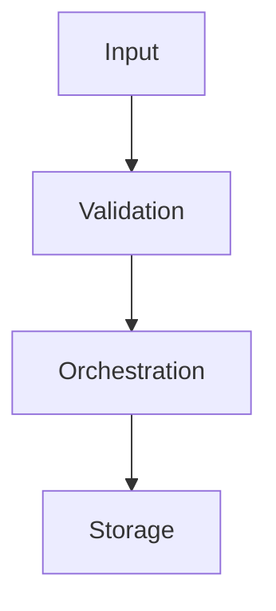

# Documentation workflow (MkDocs Material)

This project uses **MkDocs** with **Material for MkDocs** to keep technical documentation aligned with code changes.

## Goal

Keep docs updated every time the library changes (new modules, renamed packages, changed APIs, new examples, behavior changes).

## What to update when code changes

For each relevant code change, update one or more pages in `docs/`:

- `docs/api-reference.md` for public classes, functions, and method signatures.
- `docs/architecture.md` for package structure, boundaries, and data flow.
- `docs/extending.md` for extension points and custom integrations.
- `docs/getting-started.md` for installation or usage changes.

If the change is broad, also update `docs/index.md` to reflect new documentation pages.

## Required documentation checklist

Before closing a feature/refactor/bugfix, verify:

- Public API changes are documented.
- Imports/module paths are correct and match current package layout.
- At least one usage example is still valid.
- Deprecated or removed behavior is explicitly called out.

## Build and verify locally

From repository root:

```bash
pip install mkdocs-material
```

Start local docs server:

```bash
mkdocs serve
```

Or generate static docs:

```bash
mkdocs build
```

## Flowchart in documentation

Flowcharts are renderable directly in Markdown pages via Mermaid:



## Automation via project skill

This repository includes a local skill in:

- `.cursor/skills/docs-sync/SKILL.md`

Use that skill whenever introducing new modules or changing existing ones; it enforces a docs update pass and a final consistency check between code and `docs/`.
